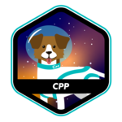

# 🤙 Hello!
<h3>I'm Edu, welcome to my github page 🤠</h3> 
I'm a <a href="https://profile.intra.42.fr/users/etachott" target="_blank">cadet at 42sp </a> studying to become a <bold>human coder</bold>👨‍🚀 
千里之行，始於足下！

### 🤖 42 Achievements 🏅

## 🚀 Skills: 
 BASH |  C |  Python |  VIM |  Linux |  VS Code |  Dev Containers 
:---: | :---: | :---: | :---: | :---: | :---: | :---:

## 🧠 Others:
<a href="https://github.com/0xEDU">

 
